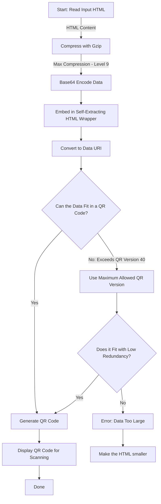

<p align="center" style="font-size: small; font-weight: lighter;">
    Yes, this is literally the entire game. <a href="https://scanqr.org/#scan">Scan it</a> and play if you want to.
</p>
DOOM is a game known for running everywhere because of the ports it has had since 1993, there have been memes on "It Runs Doom" on Tumbler since over a decade ago. People have put doom in toasters, macbook touchbars, smart fridges 

and I believe I'm the **First person to put "Doom" in a QR code**

## The Absurd Premise

QR codes can store up to 3KB of text and binary data. For context:

- This paragraph, until now is 0.4KB

- The original DOOM’s “chaingun” sprite is 1.2KB

My goal: Create a playable DOOM-inspired game _**smaller than three paragraphs** of plain text_. 💀
## How it Began

So it all started from me watching this random video a couple years ago by matttkc and being extremely intrigued by it

<p align="center">
    <a href="https://www.youtube.com/watch?v=ExwqNreocpg">
        
    </a>
</p>
<p align="center" style="font-size: small; font-weight: lighter;">
    Can you fit a whole game into a QR code?
</p>


I guess building a project like this was an idea in my subconscious all the time but I never did it, simply because I thought I'm too dumb for it

When I randomly thought of the idea last week, I knew I had to make DOOM but finding implementations and recreations of DOOM in HTML was literally impossible, so I did the next best thing 

Make a DOOM-alike from scratch

This proved to be... way too challenging, because I had access to:

- **No Game Engine** – Raw HTML/JavaScript only

- **No Assets** – All graphics generated through code

- **No Libraries** – Every byte counts

but it taught me so much!

While developing, I settled on the backdooms take because of the similarity of the concepts of the backrooms and DOOM


Unlike the guy in the video, when I had an idea to make a QR code game, I made it in HTML

- was it dumb? maybe
- did it prove to be EXTREMELY COOL later? Hell yes
### Minification

To get games to fit in these absurdly small file sizes, you need to use what is called minification 
or in this case - **EXTREMELY aggressive minification.**

take a look at some the code for the game

```html
<!DOCTYPE html><html><head><meta charset="utf-8"><style>body{margin:0;overflow:hidden;background:#000;cursor:crosshair}canvas{width:100vw;height:100vh}</style></head><body><canvas id=c></canvas><script>
M=Math,c=document.getElementById("c"),c.width=320,c.height=240,h=c.getContext("2d"),x=4,y=4,a=0,H=100,am=25,rc=0,fl=0;
f=(i,j)=>(Math.abs(i-4)<4&&Math.abs(j-4)<4)?"0":((((i+1000)%7)==3||((j+1000)%7)==3)?"0":(Math.random()<.05?"1":"0"));
e=[{x:5,y:4,h:100},{x:4,y:5,h:100}],k={};onkeydown=e=>k[e.key]=1;onkeyup=e=>k[e.key]=0;
onclick=_=>{if(am){am--;fl=2;rc=.2;e.forEach(o=>{d=M.hypot(o.x-x,o.y-y),r=M.atan2(o.y-y,o.x-x);if(d<5&&Math.abs(r-a)<.3)o.h-=50})}};
R=_=>{
rc=Math.max(0,rc-.02);fl=Math.max(0,fl-1);e=e.filter(o=>o.h>0);
h.fillStyle="#000";h.fillRect(0,0,320,240);
k.ArrowLeft&&(a-=.1);k.ArrowRight&&(a+=.1);m=.1;
```
now unless you're EXTREMELY smart, chances are, if you hadn't looked at the doctype part, you may even say this isn't HTML

I'll give you a simpler example:

```html
function drawWall(distance) {  
  const height = 240 / distance;  
  context.fillRect(x, 120 - height/2, 1, height);  
}
```

post minification:

```html
h.fillRect(i,120-240/d/2,1,240/d)  
```

Variables become single letters. Comments evaporate and our new code now resembles a cryptic ransom note.

## The Map Generation

Map: In earlier versions of development, the map was very small (16x16) and (8x8) while this could be acceptable for such a small game, I wanted something kind of playable so I managed to figure out infinite generation of maps with seed generation too 

if you've played Minecraft before, you know what seeds are - extremely random values made up of character(s) that are used as the basis for generating game worlds. 


### Making a Fake 3D Using Original DOOM's Techniques

So theoretically speaking, if you really liked one generation and figure out the seed for it, you can hardcode it to the code to get the same one each time 

```HTML
SEED = Math.random() * 100;
```

My version of a simulated 3D effect uses _raycasting_ – a 1992 rendering trick. and here's My simplified version:

1. For each vertical screen column (all 320 of them):
    
    - Cast a ray at a slightly different angle
        
    - Measure distance to nearest wall
        
    - Draw a taller rectangle if the wall is closer

```javascript
for (let i = 0; i < 320; i++) {  
  const rayAngle = playerAngle + (i - 160) / 500;  
  let distance = 0;  
  while (!isWall(x + distance * cos(rayAngle), y + distance * sin(rayAngle))) {  
    distance += 0.1; // March forward  
  }  
  drawColumn(i, distance);  
}  
```

Even though this is basic trigonometry, This calls for a significant chunk of the entire game and honestly, if it weren't for infinite map generation, I would've just BASE64 coded the URL and it would have been small enough to run directly haha - but honestly **so worth it**

## Enemy Mechanics

 This was another huge concern, in earlier versions of the game there were just some enemies in the start and then absolutely none when you started to travel, this might have worked in the small map but not at all in infinite generation 
 
 

The enemies were hard to make because firstly, it's very hard to make any realistic effects when shooting or even realistic enemies when you're so limited by file size
secondly, I'm just bad at making games

I initially made it so the enemies stood still and did nothing, later versions I added movement so they actually followed you 

much later did I finally get a right way to spawn enemies nearby while you are walking 

```HTML
            if ((k.ArrowUp || k.w || k.ArrowDown || k.s || k.ArrowLeft || k.ArrowRight) && e.length < 10 && Math.random() < .01) {
                t = Math.random() * 6.283;
                Rdist = 1 + Math.random();
                X = x + M(t) * Rdist;
                Y = y + N(t) * Rdist;
                f(~~X, ~~Y) == "0" && e.push({ x: X, y: Y, h: 100 });
            }
```

Making the game was only half the challenge, because the real challenge was putting it in a QR code

## Concept & Feasibility

The largest standard QR code (Version 40) holds 2,953 bytes (~2.9 KB).
This is **very** small—e.g., 
- a Windows sound file of 1/15th of a second is 11 KB.
- A floppy disk (1.44 MB) can store nearly **500 QR codes** worth of data.

My game's initial size came out to 3.4KB

### AH SHI-

After an exhaustive four-day optimization process, I successfully reduced the file size to 2.4 KB, albeit with a few carefully considered compromises. 

Remember how I said QR codes can store text and binary data 
Well... HTML isn't binary OR plaintext, so a direct approach of inserting HTML into a QR code generator proved futile

Most people usually advice to use Base64 conversion here, but this approach has a MASSIVE 33% overhead!
leaving less than 1.9kb for the game
**YIKES!**
I guess it made sense why matttkc chose to make Snake now 

I must admit, I considered giving up at this point. I talked to 3 different AI chatbots for two days, whenever I could - ChatGPT, DeepSeek and Claude, a 100 different prompts to each one to try to do something about this situation (and being told every single time hosting it on a website is easier!?) 
Then, ChatGPT casually threw in DecompressionStream

### DecompressionStream

DecompressionStream, a little-known WebAPI component, it's basically built into every single modern web browser.
Think of it like WinRAR for your browsers, but it takes streams of data instead of Zip files. 
That was the one moment I felt like Sheldon cooper.

the only (and I genuinely believe it because I practically have a PhD of micro games from these searches) way to achieve this was:



I swiftly scripted a Python tool to automate this entire process and, oh my god- 
### IT WORKS

It was a significant milestone, and I couldn't help but feel a sense of humor about this entire journey. Perfecting a script for this took over 34 iterations and blood, sweat, tears and processing power.

## Legacy and Accessibility

The project ([GitHub repository](https://github.com/Kuberwastaken/backdooms)) demonstrates that with creative compression and AI chatbots, even constrained mediums like QR codes!? can host fun, interactive experiences. While not practical for complex games, it opens possibilities for:

- Offline game distribution via QR posters

- Retro-style demoscene creations

- Educational tools for low-bandwidth environments

As for future updates? Let's just say adding "Version 1.1" would require removing the letter 'e' from the entire codebase. Some constraints are best left unchallenged :)


