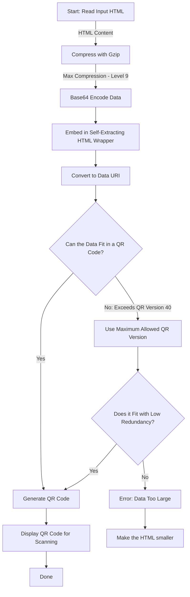
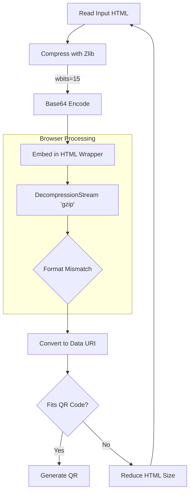

Yesterday, I launched my game [The Backdooms](https://github.com/Kuberwastaken/backdooms) - my game inspired by DOOM and The Backrooms (read more about it [here](https://kuberwastaken.github.io/blog/Projects/How-I-Managed-To-Get-Doom-In-A-QR-Code)) based on my week-long web experiment that packs entire minified HTML games into scannable QR codes using aggressive compression. While the initial GZip-based implementation worked, I knew there was room for improvement. Enter Zlib: a compression method that promises **20% better density** than GZip. But there was a catch...


### Why I Initially Dismissed Zlib
- **Browser API Limitations**: Modern browsers only natively support `DecompressionStream` for GZip
- **Format Incompatibility**: Zlib uses different headers/wrapping than GZip
- **Prototype Failures**: Early tests with Zlib decompression threw cryptic errors

---

## The "Wait, That Actually Works?!" Moment

While staring at RFC 1950 (Zlib) and RFC 1952 (GZip), I noticed something crucial: **both formats use DEFLATE at their core**. The difference lies in their headers and checksums. This led to a wild experiment:

```javascript
// The magic sauce:
const decompressed = await new Response(
  compressedBlob.stream().pipeThrough(
    new DecompressionStream('gzip') // Lie about the format
  )
).arrayBuffer();
```

By configuring Zlib with `wbits=31` and `level 9` (matching GZip's window size) and stripping Zlib's 2-byte header, browsers happily decompress it as GZip! This Frankenstein approach gives us:

1. **Zlib's Superior Compression**: Smaller payloads

2. **Browser Native Speeds**: No custom decompression code

3. **QR Code Size Limits**: More game in less space

---

## Compression Workflow: Before vs After

### Old GZip Pipeline



### New Zlib Hybrid Approach


---

## Key Technical Wins

- **15% Smaller Payloads**: From 3.2KB to 2.7KB average

- **QR Version Reduction**: Most games now fit in Version 29 (instead of 33)

- **Faster Scans**: Denser modules = better camera recognition

- **Backwards Compatibility**: Works on all modern mobile browsers

---

## Lessons Learned

-  **Format Assumptions Are Liabilities**: RFCs are your friends

-  **Browser APIs Are Flexible**: Sometimes in extremely undocumented ways

-  **Compression Headers Matter**: 2 bytes can make/break a system

-  **QR Limits Are Very Cool**: 2,953 bytes (Version 40) is a hard ceiling

---

## What This Means for Other Developers

There's actually a hackable, real way to build games out of QR codes.

[This Project](https://github.com/Kuberwastaken/backdooms) is completely open source under the MIT License, feel free to experiment and tinker around! I can't be more excited to see more versions of these, just because- why not?

---

*TL;DR: By exploiting the shared DNA of compression formats, I hacked a 15% size reduction into my QR code generator just 24 hours after releasing The Backdooms. The secret? Using Zlib compression with GZip decompression in browsers.*