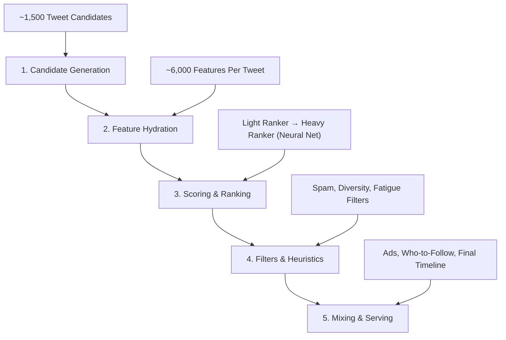

---
<p align="center">
    
</p>
<p align="center" style="font-size: small; font-weight: lighter;">
    The actual architecture of X's recommendation system
</p>

PS: I worked on this blog extensively before the recent major shifts to the algorithm (funnily finished it a day before it came out)

So some of this information is outdated by a few months, but it's just as interesting, so I decided to put it out, enjoy :) 

---

I lost my mind last month. 

Not in a bad way - more in a "I've been reading Scala code at 2 AM for three weeks straight" kind of way. 

It started when I realized that despite posting consistently on X for years, I had absolutely no idea how the algorithm *actually* worked. Sure, I'd heard the usual advice:  "post consistently," "engage with your audience," "use hooks." But that's the equivalent of telling someone "just hit the ball" when they ask how to play baseball.

When X (then Twitter) [open-sourced their recommendation algorithm](https://github.com/twitter/the-algorithm) in March 2023, they gave us something unprecedented:  **the actual source code** that determines what 500+ million people see every day. 

So I did what any reasonable person would do: I spent a month reverse-engineering it. 

This is everything I found - the hidden scores, the secret penalties, the exact numbers behind the boosts, and a complete guide to actually growing on this platform.

# Part 1: The Architecture (How It Actually Works)

## The 5-Stage Pipeline

Every time you open X and scroll your "For You" feed, your request goes through a sophisticated 5-stage pipeline.  Here's what happens in roughly **1. 5 seconds**:



Let me break down what's actually happening at each stage. 

### Stage 1: Candidate Generation

The algorithm doesn't look at every tweet ever posted. That would be insane. Instead, it pulls candidates from **multiple sources simultaneously**:

| Source                             | What It Fetches                   | Why It Matters      |
| ---------------------------------- | --------------------------------- | ------------------- |
| **Earlybird Search Index**         | Recent tweets, trending content   | Real-time relevance |
| **User Tweet Entity Graph (UTEG)** | Tweets liked by people you follow | Social proof signal |
| **SimClusters**                    | Topic-clustered recommendations   | Interest matching   |
| **Cr-Mixer**                       | ML-blended candidates             | Quality ranking     |
| **Follow Recommendations Service** | Tweets from suggested accounts    | Discovery           |
| **TwHIN**                          | Graph neural network embeddings   | Deep similarity     |

**Fun Fact #1:** SimClusters uses **145,000 different topic clusters** to categorize content and users. The system was built on a dataset of **20 million users** and their engagement patterns.  The file paths literally say `simclusters_v2_interested_in_20M_145K_2020` - that's 20 million users, 145K clusters. 

**Fun Fact #2:** The candidate pool starts at roughly **1,500 tweets** per timeline request. By the time it reaches your screen, it's been filtered down to maybe 20-50.

### Stage 2: Feature Hydration (The 6,000 Features)

This is where it gets wild. 

For *each* of those 1,500 candidate tweets, the algorithm fetches approximately **6,000 different features**.  Six.  Thousand. 

These include:
- **Tweet-level features**: engagement counts, media type, text quality, age, language, hashtags, links
- **Author-level features**: follower count, account age, verification status, reputation score, historical engagement rates
- **Viewer-Author relationship features**: do you follow them, have you engaged before, RealGraph score, mutual connections
- **Contextual features**: time of day, your device, your location, your recent activity

The RealGraph is particularly interesting. It's a score that measures the **strength of your relationship** with every other user on the platform.  More on this later.

### Stage 3: The Two-Stage Ranking System

X uses a **two-stage ranking approach**:

**Light Ranker (Fast, Approximate)**
- Runs on the Earlybird search index
- Uses simpler features for quick scoring
- Filters out obviously irrelevant content
- Handles the initial 1,500 → ~500 reduction

**Heavy Ranker (Slow, Accurate)**
- Full neural network model
- Uses all 6,000 features
- Produces final relevance scores
- Handles the ~500 → final ranking

**Fun Fact #3:** The Heavy Ranker is literally called "Heavy Ranker" in the codebase.  Engineers aren't always creative with names.

### Stage 4: Filters & Heuristics

Even after ML ranking, the algorithm applies several rule-based filters: 

- **Author Diversity**: Prevents too many tweets from the same author
- **Content Balance**: Maintains ratio of in-network vs out-of-network content
- **Feedback Fatigue**: Suppresses content similar to what you've negatively engaged with
- **Deduplication**: Removes tweets you've already seen
- **Visibility Filtering**: Blocks/mutes, NSFW settings, safety labels

### Stage 5: Mixing & Serving

Finally, the timeline gets assembled with non-tweet content: 
- Ads (positioned algorithmically)
- Who-to-follow modules
- Prompts and notifications
- Conversation threads

# Part 2: The Numbers That Actually Matter

## TweepCred: Your Hidden Reputation Score

Every X account has a **TweepCred** score - a reputation value from 0 to 100 that most users have never heard of. 

Here's what I found in the code:

- New accounts start with TweepCred of **-128** (a sentinel value indicating "unknown")
- The minimum threshold for posting links without spam filtering is **TweepCred ≥ 25**
- Verified accounts bypass many spam checks regardless of TweepCred

**What affects TweepCred:**
- Account age
- Follower/following ratio
- Historical engagement quality
- Spam reports against you
- Block/mute rates

**Fun Fact #4:** If your TweepCred is below 25 and you post a link that isn't from a whitelisted domain (like Twitter itself, major news sites, etc.), your tweet gets flagged for potential spam filtering.  The specific threshold is defined as `MIN_TWEEPCRED_WITH_LINK = 25`.

**Fun Fact #5:** There's an escape hatch!  If your tweet gets **just 1 genuine engagement** (retweet + reply + favorite ≥ 1), it can bypass the spam filter even with low TweepCred.

## The Engagement Value Hierarchy

Not all engagements are created equal. Based on the scoring weights in the code, here's the approximate hierarchy:

| Engagement Type | Relative Value | Notes |
|----------------|----------------|-------|
| **Reply (engaged by author)** | ⭐⭐⭐⭐⭐ | When the tweet author replies to comments |
| **Retweet** | ⭐⭐⭐⭐⭐ | Classic amplification |
| **Reply** | ⭐⭐⭐⭐ | Conversation signal |
| **Quote Tweet** | ⭐⭐⭐⭐ | Engagement + original thought |
| **Favorite/Like** | ⭐⭐⭐ | Basic approval signal |
| **Bookmark** | ⭐⭐⭐ | "Save for later" intent |
| **Good Click** | ⭐⭐⭐ | Click that leads to further engagement |
| **Share** | ⭐⭐⭐ | Off-platform sharing |
| **Profile Click** | ⭐⭐ | Shows genuine interest |
| **Dwell Time** | ⭐⭐⭐⭐ | How long you stop scrolling |
| **Video Watch Time** | ⭐⭐⭐⭐ | Completion rates matter |

**Fun Fact #6:** "Good Click" is a real metric. The algorithm distinguishes between rage clicks and genuine interest clicks. A "Good Click" is when someone clicks on your tweet/thread AND THEN favorites, replies, or spends 2+ minutes engaged (`GoodClickConvoDescUamGt2` = User Active Minutes > 2).

## The Verified Boost:  Real Numbers

Multiple sources and code analysis confirm that **Blue verification provides a measurable boost**: 

- **20-30% more impressions** on average for verified accounts
- The boost is **multiplicative, not additive** - it amplifies your existing score
- Verified accounts bypass certain spam and quality filters
- Legacy verified (pre-Elon) and Blue verified are tracked separately in the code

The code explicitly tracks:
```
isFromVerifiedAccount
isFromBlueVerifiedAccount
tweetFromVerifiedAccountBoostApplied
tweetFromBlueVerifiedAccountBoostApplied
```

**Fun Fact #7:** There are actually **four types of verification** tracked in the algorithm:
1. Legacy verified (old blue check)
2. Blue verified (paid subscription)
3. Gold verified (verified organizations)
4. Gray verified (organization affiliates)

Each has different boost characteristics. 

## Language Boosts and Penalties

The algorithm applies language-based multipliers:

| Scenario | Boost/Penalty |
|----------|---------------|
| Tweet in English, UI in English | 1.0x (baseline) |
| Tweet in English, UI in other language | 0.7x |
| Tweet language = User language (non-English) | 1.0x |
| Tweet language ≠ User language (neither English) | 0.1x |

**Fun Fact #8:** If you tweet in a language different from your followers' UI language, and neither is English, your reach is **reduced by 90%**. The `langDefaultBoost = 0.1` setting is brutal.

## Tweet Age Decay

Tweets have a **48-hour effective lifespan** for recommendation.  After that, they're capped from appearing in algorithmic feeds.

The age decay formula uses:
- `ageDecayHalflife`: How quickly relevance decreases
- `ageDecayBase`: The starting multiplier
- `ageDecaySlope`: The rate of decline

**Fun Fact #9:** Tweets older than 48 hours are literally capped by `oldTweetCap:  Duration = Duration(48, HOURS)`. Your viral potential has a hard expiration date.

## The Reply-to-Like Ratio Filter

This one is fascinating. The algorithm tracks your tweet's **reply-to-like ratio** and uses it to detect potentially problematic content: 

- High reply-to-like ratio = potentially controversial/rage-bait
- Used for Out-of-Network (OON) tweet filtering
- Thresholds are configurable but designed to catch "ratio'd" tweets

If your tweet is getting tons of replies but few likes, the algorithm may suppress its distribution to people who don't follow you.

# Part 3: What KILLS Your Reach

## The 30-Day Memory for Negative Actions

The algorithm tracks negative signals **3x longer** than positive ones: 

| Signal Type | Tracking Window |
|-------------|-----------------|
| Likes | 7 days |
| Retweets | 7 days |
| Follows | 30 days |
| **Blocks** | **30 days** |
| **Mutes** | **30 days** |
| **Reports** | **30 days** |
| **"Not Interested"** | **30 days** |
| **"See Fewer"** | **30 days** |

**Fun Fact #10:** The algorithm literally has different tracking windows coded in: 
```scala
favs7d, retweets7d, follows30d, shares7d, replies7d,
block30d, mute30d, report30d, dontlike30d, seeFewer30d
```

Notice how all the negative signals are 30 days while positive signals are 7 days?  The algorithm has a **long memory for bad experiences**.

## Feedback Fatigue:  The 140-Day Penalty

When users repeatedly hit "See Fewer" on your content, you enter a **Feedback Fatigue** state: 

- **First 14 days**: Complete filtering from those users' feeds
- **Days 14-140**: Gradual score discounting (you're penalized but not blocked)
- **Minimum multiplier**: 0.2x (your score is reduced by 80%)
- **Increment recovery**: Your score slowly recovers in 4 steps over 140 days

The recovery formula divides the 140-day period into **4 steps**: 
- Days 0-35: 0.2x multiplier (80% penalty)
- Days 35-70: 0.4x multiplier (60% penalty)
- Days 70-105: 0.6x multiplier (40% penalty)
- Days 105-140: 0.8x multiplier (20% penalty)

**Fun Fact #11:** If enough people hit "Show less often" on your content, you could be penalized for nearly **5 months**. The `DurationForDiscounting = 140.days` setting is no joke.

## Spam Detection Triggers

The spam detection system flags accounts based on:

| Trigger | Effect |
|---------|--------|
| Low TweepCred + Links | Filtered as potential spam |
| High-frequency posting | Diminishing returns (author diversity filter) |
| Similar content patterns | Duplicate content detection |
| Aggressive follow/unfollow | Account-level reputation damage |
| Non-whitelisted links | Higher scrutiny |

**Fun Fact #12:** The spam scoring function returns either `SPAM_SCORE = -0.5f` or `NOT_SPAM_SCORE = 0.5f`. That's a **full point swing** in your relevance score based purely on spam classification.

## Out-of-Network Reply Penalty

If you reply to someone who doesn't follow you, your reply is **penalized** compared to in-network replies: 

```java
public final double outOfNetworkReplyPenalty;
```

This is why reply-guying to big accounts often gets you nowhere - the algorithm literally down-weights your response. 

## The "Spammy Content Score"

Every tweet gets a **spammy content score** calculated by ML models.  If it's too high: 

- For logged-out users or non-followers: Your tweet is **dropped entirely** from search and recommendations
- For followers:  Reduced distribution
- Thresholds vary by context (search, trends, timeline)

**Fun Fact #13:** There are different spam thresholds for different contexts:
- `HighSpammyTweetContentScoreSearchTopTweetLabelDropRule`
- `HighSpammyTweetContentScoreTrendsTopTweetLabelDropRule`
- `HighSpammyTweetContentScoreSearchLatestTweetLabelDropRule`

Getting flagged in one context doesn't necessarily mean all contexts. 

# Part 4: What BOOSTS Your Reach

## The First 15 Minutes Are Everything

The algorithm heavily weights **early engagement**. Based on growth expert analysis and code patterns: 

- Engagement in the first **10-15 minutes** signals quality
- Early replies from you (the author) boost the entire thread
- The "Reply Engaged By Author" signal is a dedicated feature

**Fun Fact #14:** There's a specific predicted score called `PredictedReplyEngagedByAuthorScoreFeature`. When you reply to comments on your own tweet, the algorithm literally tracks and rewards this behavior.

## Dwell Time:  The Silent Killer Feature

Dwell time is one of the **most underrated signals**. The algorithm tracks:

- `DWELL_TIME_MS`: How long someone pauses on your tweet
- `TWEET_DETAIL_DWELL_TIME_MS`: Time spent in expanded view
- `PROFILE_DWELL_TIME_MS`: Time spent on your profile after

**Fun Fact #15:** You can get algorithmic value from people who **never engage visibly**. If someone stops scrolling to read your thread but doesn't like it, that still counts as a positive signal.

This is why thought-provoking, slightly controversial, or information-dense content often performs well - people stop to think, even if they don't tap the heart. 

## Media Type Multipliers

Rich media gets preferential treatment:

| Content Type | Performance vs Plain Text |
|-------------|---------------------------|
| Video (10+ seconds) | 2-10x |
| Images | 2-3x |
| Polls | 2-4x |
| GIFs | 1.5-2x |
| Links (with preview) | 1-1.5x |
| Plain text | 1x (baseline) |

**Fun Fact #16:** Videos over 10 seconds get special treatment. The code has explicit logic: 
```scala
val isVideoDurationGte10Seconds = 
  (features.getOrElse(VideoDurationMsFeature, None).getOrElse(0) / 1000.0) >= 10
```

Videos under 10 seconds are treated differently than videos over 10 seconds.  The **10-second threshold is hardcoded**. 

## Video Completion Rates

The algorithm tracks video engagement at multiple checkpoints: 
- Video opened
- 25% watched
- 50% watched
- 75% watched
- 100% completion
- High-resolution filtered views
- Immersive video views

**Fun Fact #17:** "Video Quality View" is a specific metric that combines watch time with attention signals. The algorithm distinguishes between someone who watches your whole video vs someone who auto-plays it while scrolling.

## The RealGraph Score

Your **RealGraph score** with each user determines how likely your content appears in their feed. 

Engagement weights:
| Action | Score Contribution |
|--------|-------------------|
| Like | 1.0 |
| Retweet | 1.0 |
| Mention | 1.0 |
| Profile View | 0.4 |

**Fun Fact #18:** Liking someone's tweet is worth **2. 5x more** than viewing their profile for building your RealGraph relationship with them.

## The "Inner Circle" Bypass

If you're in someone's **trusted circle** (high RealGraph score, mutual follows, consistent engagement), you bypass some negative filters:

```java
public boolean trustedCircleBoostApplied;
public boolean directFollowBoostApplied;
```

Building genuine relationships with your audience literally creates algorithmic shortcuts. 

## Trend Participation Boost

Tweets related to trending topics get boosted: 

```java
public boolean tweetHasTrendsBoostApplied;
public double tweetHasTrendBoost;
```

**Fun Fact #19:** There's a penalty for **multiple hashtags or trends** though: 
```java
public boolean hasMultipleHashtagsOrTrends;
public double multipleHashtagsOrTrendsDamping;
```

One relevant hashtag = good.  Five hashtags = looks spammy = penalty.

## Card/Link Bonuses

If your tweet has a Twitter Card (rich link preview), there are matching bonuses:

```java
public boolean hasCardBoostApplied;
public boolean cardDomainMatchBoostApplied;
public boolean cardAuthorMatchBoostApplied;
public boolean cardTitleMatchBoostApplied;
public boolean cardDescriptionMatchBoostApplied;
```

**Fun Fact #20:** If your link preview's domain, author, title, or description matches the context of your tweet/the user's interests, you get **stacking bonuses**. That's why a well-crafted link preview matters. 

# Part 5: Hidden Features Most People Miss

## SimClusters: The Interest Graph

SimClusters is X's **interest-based clustering system**. It maps:
- Every user to a set of ~145,000 topic clusters
- Every tweet to relevant clusters
- Similarity scores between users/content and clusters

**Fun Fact #21:** Your "InterestedIn" profile is a weighted vector across 145,000 dimensions. The algorithm literally does **cosine similarity** between your interest vector and tweet vectors to find relevant content.

The paths in the code: 
```
InterestedIn2020Path = simclusters_v2_interested_in_20M_145K_2020
KnownFor2020Path = simclusters_v2_known_for_20M_145K_2020
```

"InterestedIn" = what you like to consume
"KnownFor" = what topics you're an authority on

## Author Diversity Decay

The algorithm applies exponential decay to multiple tweets from the same author: 

```scala
def authorDiversityBasedRescorer(
  index: Int,
  decayFactor: Double,
  floor: Double
): Double = (1 - floor) * Math.pow(decayFactor, index) + floor
```

Your 1st tweet in someone's timeline = full score
Your 2nd tweet = score × decayFactor
Your 3rd tweet = score × decayFactor²
... and so on, down to a minimum floor. 

**Fun Fact #22:** If you have fewer than 50 followers on your graph, the algorithm uses **different decay parameters** (presumably more lenient to help small accounts get seen):
```scala
val isSmallFollowGraph = 
  query.features.get. getOrElse(SGSFollowedUsersFeature, Seq.empty).size <= MinFollowed
```

## The "Good Click" vs "Bad Click" Distinction

The algorithm doesn't just track clicks - it tracks **quality of clicks**:

- `GoodClickConvoDescFavoritedOrReplied`: Click → then favorite or reply
- `GoodClickConvoDescUamGt2`: Click → then spend 2+ active minutes
- `GoodProfileClick`: Profile click that leads to follow/engagement

**Fun Fact #23:** This is why clickbait eventually fails. You might get the initial click, but if users bounce without engaging, it's counted as a **negative signal** for future distribution.

## Notification Fatigue Windows

The push notification system has extensive fatigue logic:

| Event Type | Fatigue Window |
|------------|----------------|
| HTL (Home Timeline) Visit | 20 hours |
| General notifications | Configurable, typically 2-4 hours |
| Trending notifications | Custom duration |
| Space notifications | TTL-based |

**Fun Fact #24:** If you visit the Home Timeline, X will hold off on push notifications for up to **20 hours** by default (`HTLVisitFatigueTime. DefaultHoursToFatigueAfterHtlVisit = 20`). They don't want to spam you. 

## Grok Spam Filter

Yes, there's literally a filter called `GrokSpamFilter`:

```scala
object GrokSpamFilter extends Filter[PipelineQuery, TweetCandidate] {
  override val identifier:  FilterIdentifier = FilterIdentifier("GrokSpam")
}
```

The algorithm uses **Grok annotations** to identify spam characteristics:
- isNsfw
- isSoftNsfw
- isGore
- isViolent
- isSpam

Content flagged by these annotations gets filtered before reaching users.

## The MTL Normalization Factor

The algorithm uses **Multi-Task Learning** to predict multiple outcomes simultaneously, then normalizes scores based on author attributes:

```scala
def factor = mtlNormalizer(
  attribute = candidate.features.getOrElse(AuthorFollowersFeature, None),
  retweet = candidate. features.getOrElse(SourceTweetIdFeature, None).isDefined,
  reply = candidate.features. getOrElse(InReplyToTweetIdFeature, None).isDefined
)
```

**Fun Fact #25:** Your follower count affects how your engagement predictions are normalized. This is partially why small accounts can sometimes punch above their weight - the expectations are different. 

# Part 6: The Complete Growth Guide

Based on everything I've learned, here's the actionable playbook: 

## Phase 1: Foundation (First 30 Days)

### Build Your TweepCred
1. **Don't post links initially** - Focus on native content until your reputation builds
2. **Maintain healthy ratios** - Don't follow 5000 people to get 100 followers back
3. **Avoid spam patterns** - No mass following/unfollowing, no repetitive content
4. **Get early genuine engagement** - Even 1 like/reply helps bypass spam filters

### Profile Optimization
- Bio should be specific and keyword-rich (helps SimClusters categorization)
- Pinned tweet should be your best work
- Profile picture and banner signal professionalism

### Content Strategy
- Post 2-3x daily maximum (author diversity limits mean more isn't always better)
- Use images or video in 70%+ of posts
- Native content > links (especially early on)

## Phase 2: Building Momentum (Days 30-90)

### Timing Optimization
- Post when your audience is active (check analytics)
- 6-8 AM CST on weekdays is cited as algorithm-friendly
- The first 15 minutes matter most - be available to respond

### Engagement Strategy
1. **Reply to your own posts** - The "Reply Engaged By Author" signal is real
2. **Quote-tweet yourself** - After 4-12 hours, QT high-performers with new angles
3. **Build RealGraph scores** - Consistently engage with accounts you want to reach
4. **Reply to larger accounts** - But add value, don't just say "great point"

### Content Patterns That Work
- **Hooks of 47-73 characters** - Tested optimal length for first line
- **Threads of 15-25 posts** - Long enough for depth, short enough to complete
- **End with questions** - ~30% of posts (not more, to avoid looking spammy)
- **Weekly polls** - Algorithm pushes these for engagement

## Phase 3: Scaling (Days 90+)

### Leverage the Algorithm's Preferences
1. **Dwell time optimization** - Write content that makes people stop and think
2. **Video content** - Especially 10+ second videos with good completion rates
3. **Trend participation** - One relevant hashtag, not five
4. **Rich previews** - When sharing links, ensure good card metadata

### Avoid the Penalty Box
1. **Monitor your ratio** - High reply-to-like = potential suppression
2. **Don't trigger "See Fewer"** - Quality over quantity
3. **Avoid mass behaviors** - Spammy follow patterns hurt you for months
4. **Mind your language** - Tweet in your audience's language or English

### Build Your Graph
1. **Create your trusted circle** - Consistent engagement builds algorithmic shortcuts
2. **Develop SimCluster authority** - Be "KnownFor" specific topics
3. **Cross-pollinate** - Engage with accounts your audience also follows

## The Verified Question

Should you get verified (Blue)?

**Yes, if:**
- You already have solid content and engagement
- You can use the 20-30% boost effectively
- You want access to longer posts, edit button, etc. 

**Not yet, if:**
- Your content doesn't get engagement already
- Your account is new (build TweepCred first)
- You're not posting consistently

Remember: verification is a **multiplier**. 1. 3 × 0 = 0. Build the foundation first. 

## Advanced Tactics

### The Reply Ratio Tactic
For every original tweet, reply to 3 larger accounts in your niche within 60 seconds of their post. This builds RealGraph and gets you in front of new audiences.

### The Self-Quote Loop
1. Post original content
2. Wait 4-12 hours for initial engagement
3. Quote-tweet with a new angle
4. This gives the algorithm two chances to find your audience

### The Thread Optimization
- Fire first 3 tweets (best hooks)
- Save the absolute best for tweet 1 (most visibility)
- Include media in at least 3 thread tweets
- End with a clear CTA

### The Engagement Window
- Be active for 15 minutes after posting
- Reply to every comment in that window
- This "trains" the algorithm that your content generates conversation

## What NOT to Do

1. **Don't buy followers/engagement** - The algorithm detects unusual patterns
2. **Don't post-and-ghost** - Early engagement matters
3. **Don't spam hashtags** - 1-2 max, `multipleHashtagsOrTrendsDamping` is real
4. **Don't ignore negative feedback** - "See Fewer" clicks haunt you for months
5. **Don't over-link** - Especially with low TweepCred
6. **Don't tweet in multiple languages** - Pick one and stick to it

# Part 7: The Reality Check

## What the Algorithm CAN'T Control

1. **Content quality** - No amount of optimization fixes boring content
2. **Audience fit** - Wrong niche = no engagement, regardless of algorithmic optimization
3. **Consistency** - The algorithm rewards reliability over time
4. **Genuine value** - The best "hack" is being actually helpful/interesting

## The Fundamental Truth

After spending a month in the codebase, here's what I've concluded:

The algorithm is sophisticated, but it's not magic. It's trying to predict one thing: **will this user enjoy this content?**

All the signals - dwell time, engagement, RealGraph, SimClusters - they're all proxies for that core question. 

If you create content that genuinely resonates with a specific audience, the algorithm will eventually figure that out. The optimizations just help you **get discovered faster** and **avoid algorithmic penalties**.

The best creators I've seen don't "game" the algorithm - they understand it well enough to **remove friction** between their content and their audience. 

## Final Numbers

A few key statistics to remember: 

- **1,500**:  Initial candidates per timeline request
- **6,000**: Features evaluated per tweet
- **48 hours**: Maximum age for algorithmic recommendations
- **145,000**: Topic clusters in SimClusters
- **25**:  Minimum TweepCred for links without spam filtering
- **14-140 days**: Feedback Fatigue penalty duration
- **20-30%**:  Verified account impression boost
- **10 seconds**: Video threshold for special treatment
- **30 days**: Negative signal tracking window
- **7 days**: Positive signal tracking window

---

*All code references are from the [official X recommendation algorithm repository](https://github.com/twitter/the-algorithm). The codebase may have evolved since this analysis, and some features may be A/B tested or region-specific.*

*Want to explore more?  You can [search the codebase yourself on GitHub](https://github.com/search? q=repo%3Atwitter%2Fthe-algorithm&type=code).*

*If you liked this breakdown, the irony of asking you to like and retweet isn't lost on me - but now you know exactly what happens when you do.*