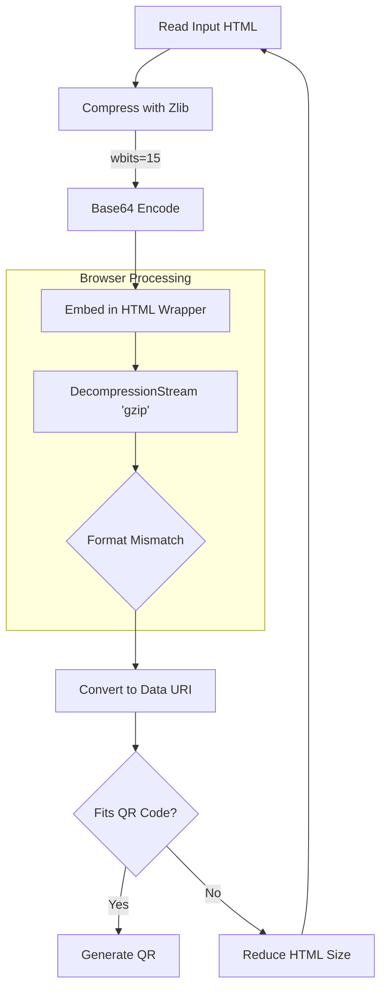

QR codes have revolutionized everyday interactions, from restaurant menus to contactless payments. Yet beneath their simple, pixelated exterior lies a VERY complex world of data encoding, error correction, and potential vulnerabilities ripe for exploitation. 
In this article, we explore the technical underpinnings of QR codes, dissect malware techniques (including the notorious “quishing”), and dive deep into the methods attackers might use to create malicious payloads. Let's see how deep I can take you down this little rabbithole :P

  

---
## 1. How Do QR Codes Even Work?

QR codes may appear as mere black-and-white patterns, but they are built on robust mathematical principles.

### Data Capacity & Encoding Modes

A single QR code can store up to **3KB of data**. Depending on the mode, this can include:
- **Numeric Mode:** Up to 7,089 digits.
- **Alphanumeric Mode:** Up to 4,296 characters.
- **Binary Mode:** Up to 2,953 bytes.

These modes allow for the flexible encoding of everything from URLs to complex scripts, and pretty much every single file if it's small enough because it can be converted to Binary.

### Error Correction: Reed–Solomon Codes

QR codes incorporate error correction to ensure readability even if the code is partially damaged. There are four levels:
- **L (7% recovery)**
- **M (15% recovery)**
- **Q (25% recovery)**
- **H (30% recovery)**

The Reed–Solomon algorithm embeds redundant data so that even if parts of the QR code are obscured or altered, the original data can be reconstructed. However, this redundancy can also be exploited by attackers to hide extra, malicious information within what appears to be “noise.”

  

---

## 2. Technical Anatomy of a QR Code Malware Attack

QR codes are inherently neutral, they just encode data. The danger arises when this data is manipulated to serve malicious purposes.

### Data Encoding & Compression

Malware authors can embed:

- **Obfuscated URLs:** Using URL shortening or binary encoding methods.
- **Compressed Payloads:** Data can be minified and compressed using algorithms like Zlib and Gzip. This is how I managed to fit an entire re-creation of Doom into one QR code in my game The Backdooms ([You can read more about it here](https://kuberwastaken.github.io/blog/Projects/How-I-Managed-To-Get-Doom-In-A-QR-Code))

### Error Correction Exploitation

By selecting a higher error correction level (e.g., Level H), an attacker can insert extra data that is “corrected out” during normal scanning. This technique hides a malicious payload beneath layers of seemingly redundant error correction code.

### Vulnerabilities in QR Code Readers

Many QR scanning apps prioritize speed over security:
- **Auto-Redirection:** Some apps immediately redirect to the URL without previewing it.
- **Insufficient URL Validation:** Lack of proper validation can lead to automatic downloads of malware.
- **Image Processing Bugs:** Vulnerabilities in the libraries used to decode QR images can be exploited for code execution.

---

## 3. Deep Dive: How are These Practically Created

*Disclaimer: The following technical discussion is for educational purposes only. It is not intended to provide a step-by-step guide to building malware.*

### Embedding Malicious URLs and Payloads

Attackers typically start with a malicious payload - this could be a trojan, ransomware, or even a script that exploits a vulnerability in the QR reader. The payload is hosted on a remote server, and the QR code encodes a URL pointing to that server. Techniques include:

- **URL Obfuscation:** Using URL shorteners or encoding schemes to disguise the true destination.
- **Multi-Stage Payloads:** The initial URL may lead to a small downloader that retrieves the full payload, minimizing the QR code’s visible data footprint.

### Custom Compression Algorithms:

In my *Backdooms* project, I developed a custom compression algorithm using a hybrid of Zlib and Gzip. By:

- **Minifying HTML/JavaScript:** Removing unnecessary whitespace and comments.
- **Optimizing Data Structures:** Using efficient binary representations for graphics and game logic.
- **Leveraging Error Correction:** Embedding the compressed data within the extra redundant bits allowed by low-level error correction.

This experiment proved that if an entire game can be packed into a few kilobytes, something like this didn't exist before, but I'm quite sure similar techniques could and might is being used to hide malicious code - potentially a full-fledged malware payload, in a single QR code.

### Exploiting QR Reader Flaws

Developers of malicious QR codes target weaknesses such as:
- **Lack of Pre-Scan Warnings:** Many QR readers don’t display a URL preview.
- **Inadequate Sandboxing:** Some apps fail to run the downloaded code in a secure, isolated environment.
- **Legacy Library Vulnerabilities:** Older versions of image decoding libraries may be susceptible to buffer overflows or other exploits.

---

## 4. Advanced Malware Techniques: Beyond the Basics

Once the basics of data embedding are mastered, sophisticated attackers layer additional techniques to bypass security measures.

### Trojan Delivery & Ransomware via QR Codes

- **Banking Trojans:** For instance, QR codes can trigger downloads of trojans like Coper, which incorporate obfuscation techniques to evade antivirus software.
- **Ransomware Campaigns:** Codes can redirect users to sites that immediately download ransomware, locking the device until a ransom is paid.
- **Botnet Recruitment:** Devices may be silently enrolled into botnets used for DDoS attacks or other coordinated cyber activities.

### Quishing: QR Code Phishing

“Quishing” leverages QR codes in phishing attacks:
- **Fake Login Pages:** A QR code may lead to a counterfeit site mimicking a bank or government portal.
- **Cross-Device Exploitation:** An email sent to a corporate machine might display a QR code, which is then scanned by a personal device running outdated security software.
- **Social Engineering:** Attackers design urgent, persuasive messages to lure users into scanning the code without due diligence.

### Multi-Stage & Multi-Code Attacks

Some attacks employ a sequence of QR codes:
- **Sequential Activation:** Each QR code in a series reveals part of the malicious payload. Only when all codes are scanned does the full payload assemble and execute.
- **Fallback Mechanisms:** If one QR code fails or is detected, a secondary code might activate, ensuring the attack proceeds.

---

## 5. Defensive Strategies: Hardening Against QR Code Attacks

Both individuals and organizations can adopt robust measures to counter these threats.

### For Individuals

- **Use Trusted QR Readers:** Choose apps that preview URLs and check for anomalies.
- **Keep Systems Updated:** Ensure your mobile OS and QR scanning apps have the latest security patches.
- **Install Security Software:** Utilize antivirus and anti-malware applications capable of detecting suspicious downloads.

### For Organizations

- **Employee Training:** Regular cybersecurity awareness sessions can help staff recognize and avoid quishing tactics.
- **Dynamic QR Codes:** Deploy QR codes that allow real-time updating of their destination URLs in case of compromise.
- **Regular Audits:** Conduct frequent inspections of physical QR codes in public areas to detect tampering.
- **Multi-Factor Authentication (MFA):** Even if credentials are compromised, MFA can provide a critical barrier against unauthorized access.
- **Advanced Filtering:** Implement email and network filters that can analyze embedded images to flag potential threats.

---

## 7. The Future of QR Code Security

The interplay between convenience and security will continue to evolve:
- **Blockchain Verification:** Immutable blockchain records could verify QR code integrity.
- **AI-Powered Analysis:** Future QR scanners may incorporate machine learning to detect abnormal patterns in QR code data.
- **Embedded Digital Signatures:** New QR code standards might include built-in digital certificates, ensuring that codes are authentic before they’re scanned.
- **Enhanced Regulatory Standards:** As the threat landscape grows, expect tighter government and industry regulations to safeguard digital transactions.

---

## 8. Conclusion & FAQs

QR codes offer unmatched convenience, but their technical complexity can be manipulated for nefarious purposes. From basic data encoding to advanced malware embedding techniques, understanding the underlying mechanics is essential for both cybersecurity professionals and everyday users. My *Backdooms* experiment—a demonstration of compressing an entire game into a QR code—serves as a potent reminder of the potential dangers hidden within these digital squares.

Stay informed, remain cautious, and always verify before you scan.

---
*Sources: [Malwarebytes](https://www.malwarebytes.com/blog/news/2024/11/malicious-qr-codes-sent-in-the-mail-deliver-malware), [Barracuda](https://blog.barracuda.com/2024/10/22/threat-spotlight-evolving-qr-codes-phishing-attacks), [Scanova](https://scanova.io/blog/qr-code-security-issues), [FT](https://www.ft.com/content/8aca741e-6448-4511-a54d-64f3a97747b1), [Bild](https://www.bild.de/cmsid/66ffcb73fc1bc97658be9fe0), [Tripwire](https://www.tripwire.com/state-of-security/quishing-emerging-threat-fake-qr-codes)*  

